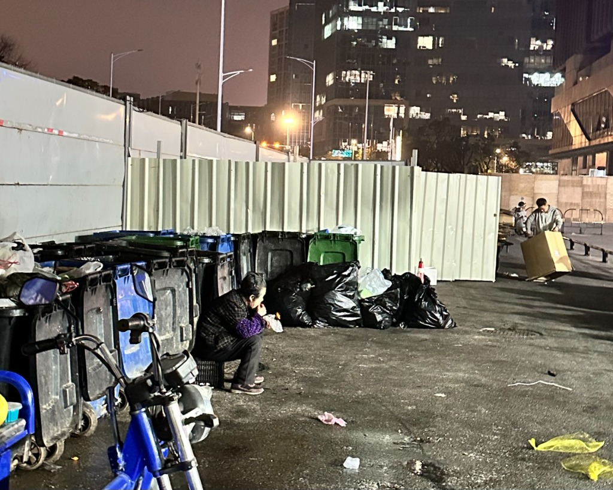

## Dinner by the Trash Can

I went downstairs to take out the trash tonight. The evening was gray and the wind was biting. Backpack on and badminton racket in hand, I was on my way to meet my girlfriend, grabbing the garbage bags on my way out.

**Next to the dumpsters, an older woman was curled up against the cold.**

She was clutching a roasted sweet potato, eating it with such intense focus that she seemed lost in her own world, completely cut off from everything else. I couldn't bring myself to just toss the bags in. Instead, I set them down gently and carefully—I neither wanted the dust from the heavy bags to soil her food, nor did I want a sudden crash to shatter the fragile peace she seemed to have found.

<i>(That was the only "peace" in the winter night)</i>

---

## Curled Up Peace

But is that actually "peace"?

If I were the one eating dinner next to a trash can, absolutely not. But for her, **why did she choose this?**

The answer was obvious: She’s a cleaner. This was just where she happened to be taking her dinner break. She surely must have thought about finding a clean, warm place to eat a decent meal, but she didn't. **She chose to hunch over, curled up next to the garbage bins that most people avoid at all costs, because only here could she find some shelter from the winter wind.**

Looking at her, I suddenly thought of myself, who is always dreaming about the future.

I dream of traveling the world, experiencing different cultures, and exchanging ideas with different people. **Yet, right now, I can only curl up in a corner of my own world.** The daisies on the balcony are blooming, but I feel my own life is slowly withering.

## Life is a Cage

Responsibilities, family expectations, societal norms, and even our own self-imposed rules form invisible chains that trap us in place. We end up sacrificing our most vigorous energy and most precious time to this world.

Not everyone is dissatisfied with this, but **many people are indeed not happy**. This strongly reminded me of that famous metaphor:

> Boiling Frog:
>
> If we were thrown directly into the "boiling water" of that woman's harsh reality, we might instinctively struggle and escape;
> 
> **But if placed in lukewarm water that is slowly heated until it boils, we might not even realize the danger.**

Why are we unsatisfied with the status quo yet never think of breaking free? **Maybe we’ve thought about it, but ultimately, we just don't have the guts.**

I guess that’s just life.
