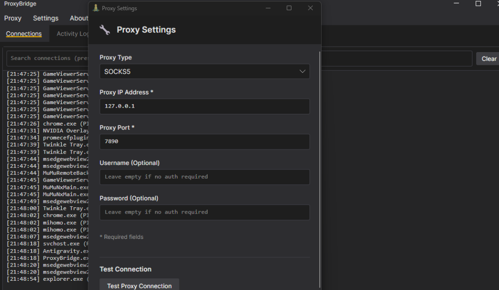
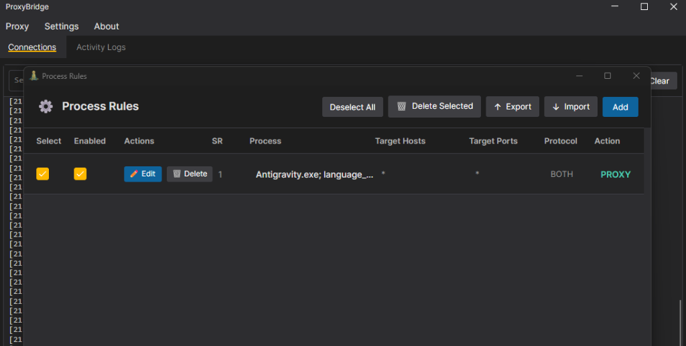

## 0x0 Introduction

Many users find it impossible to log in when using Antigravity, especially under certain network environments.

Today, I’m sharing two proven methods to help you completely solve this problem.

## 0x1 Method 1: Enable TUN Mode in Your Proxy Software

If you are using **Clash** as your proxy software, you need to enable its **TUN Mode** (i.e., virtual network card mode) in the settings, and you must click to install the service/network card.

If you are using other proxy software, you similarly need to find and enable the "virtual network card" or "TUN Mode" feature, and then turn on the system proxy. This allows your proxy software to take over all network requests.

After completing these two steps, you can use the **[Gravity Tools](https://github.com/lbjlaq/Antigravity-Manager)** helper software for account management. Even if you have trouble logging in directly, you can switch accounts within this software to achieve a workaround login.

## 0x2 Method 2: Forced Proxy using Proxy Bridge (Recommended)

Recently, I found that the method above sometimes fails. Therefore, I will teach you this more thorough method below.

The core of this method is to download the **Proxy Bridge** software and force a proxy for the `Antigravity.exe` program within it. The specific steps are as follows:

### Step 1: Download and Install the Software
First, download Proxy Bridge. This is an open-source project that is safe and reliable, so you can install and use it with confidence.
👉 [Click here to get the Proxy Bridge download link](https://github.com/InterceptSuite/ProxyBridge/releases)

### Step 2: Set Up Local Proxy
Open the software, click `Proxy` in the top left corner, and select `Proxy Settings`.
Set the proxy to your local proxy, for example, `127.0.0.1:7890`.
> **Note:** The port number here (e.g., 7890) must exactly match the local listening port of the proxy software you are currently using.

### Step 3: Add Proxy Rules
Click `Proxy` in the top left corner, select `Process Rules`, and then click `Add` to add a new rule.

In the pop-up window, add the following two programs:
* `Antigravity.exe`
* `language_server_windows_x64.exe`

Then, set their network protocol to **use proxy for both UDP and TCP**.

---

Once all settings are complete, reopen and log into Antigravity, and you should be able to connect successfully. If you are troubled by login issues, go try it now!
